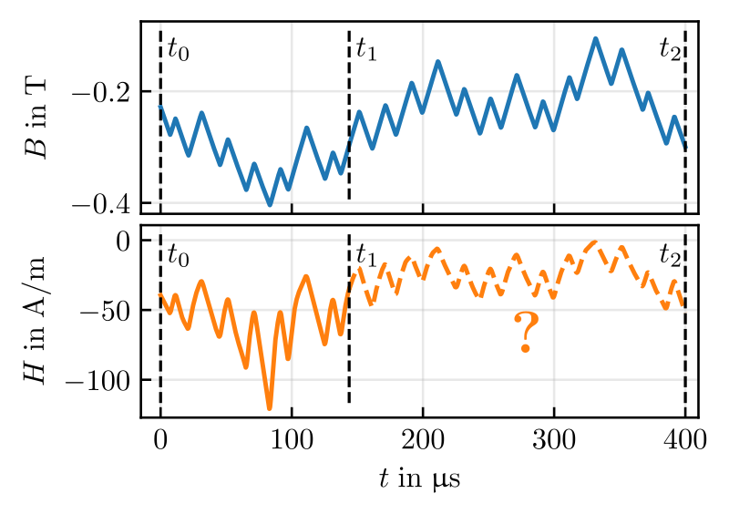
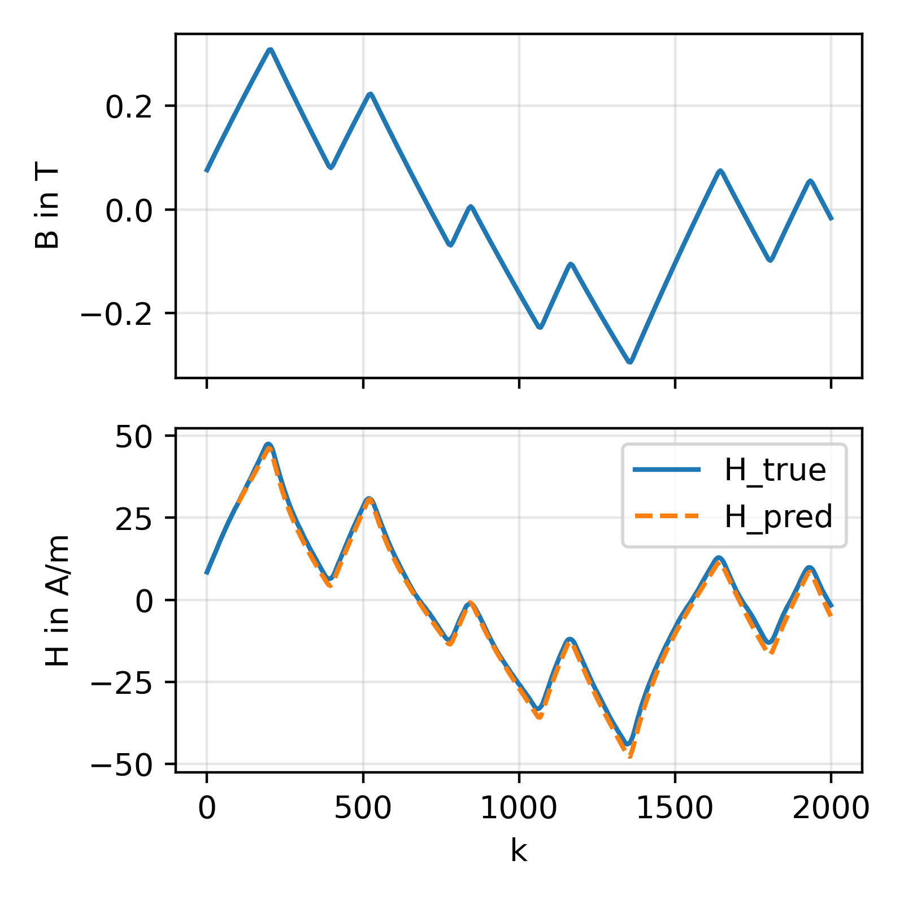
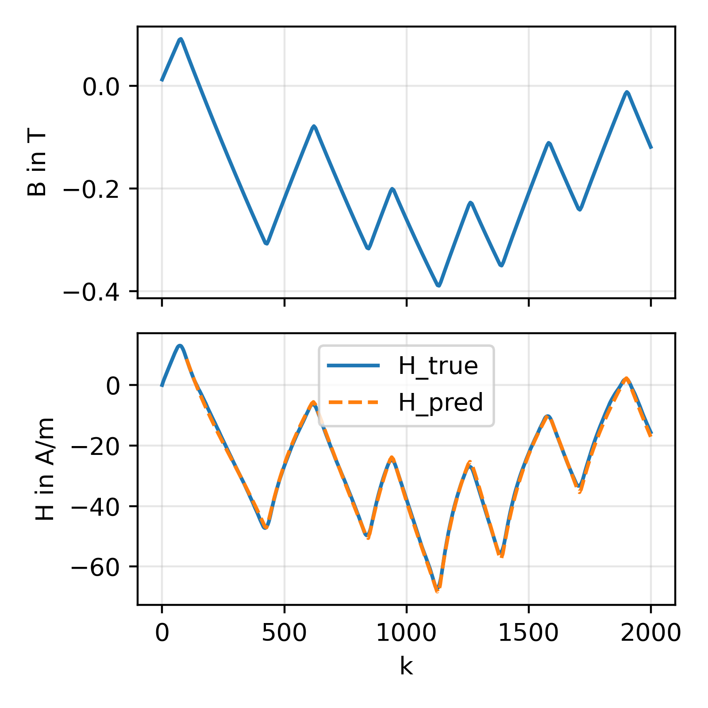
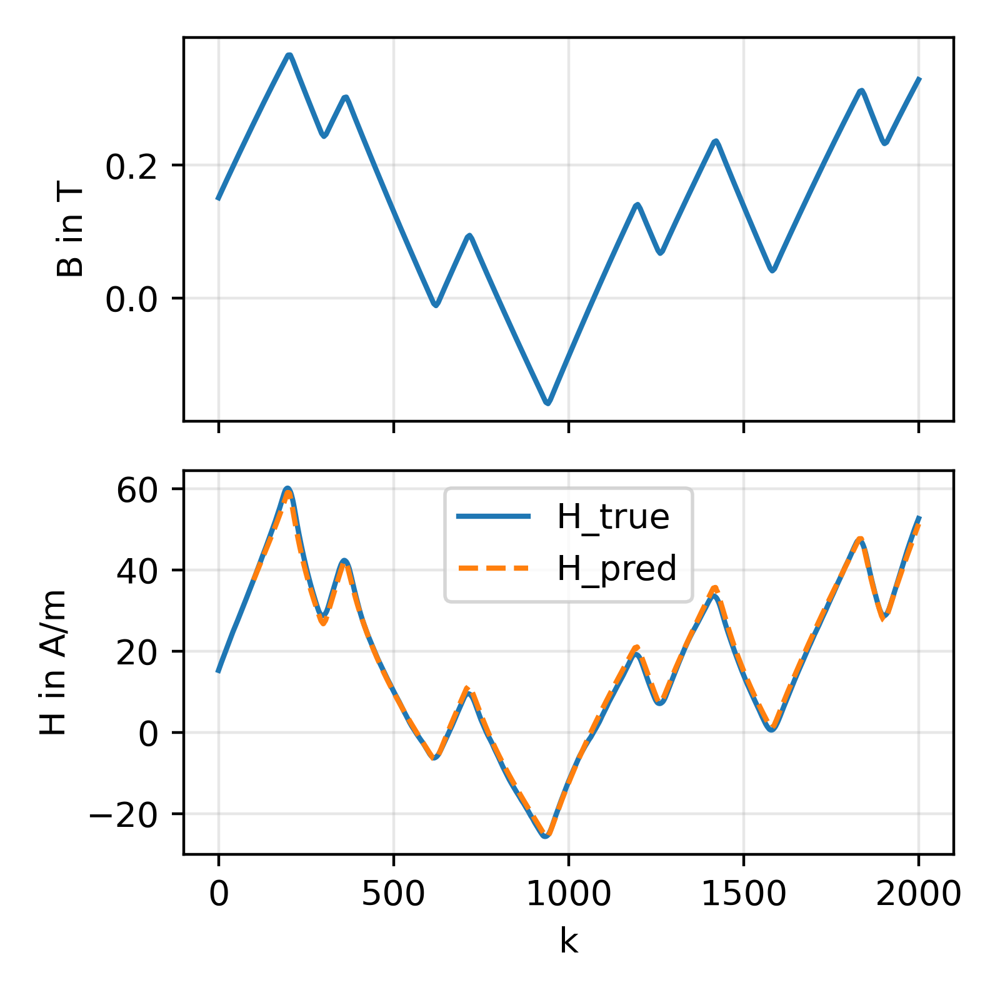
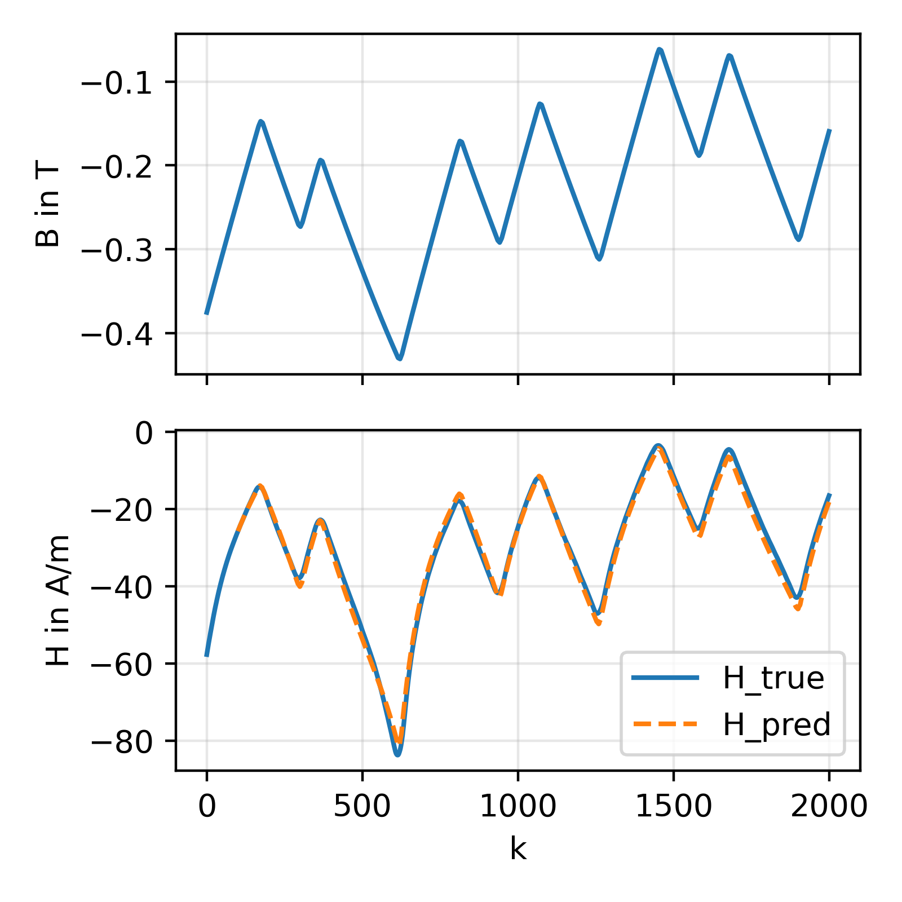
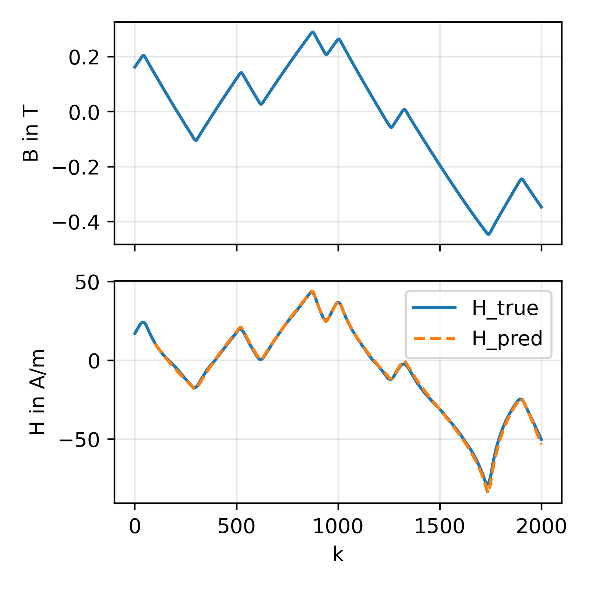

# magnet-challenge-2

This is the contribution of Team "Siegen and Paderborn" to the MagNet Challenge 2 (MC2).

Official site for the second magnet challenge https://github.com/minjiechen/magnetchallenge-2

## The task:
Estimate the scalar magnetic field $\hat{H}_t$ with $t \in \left[t_1, t_2\right)$ based on the previously observed magnetic field $H_t$ with $t \in \left[t_0, t_1\right)$, the magnetic flux density $B_t$ with $t \in \left[t_0, t_2\right)$, and the temperature $\vartheta$.



## Installation:
- use `python3.11` (specifically python3.11.11, should not make a difference though)
- `git clone git@github.com:upb-lea/magnet-challenge-2.git` the repo to your PC or workstation
- create a fresh virtual enviornment (e.g., `python -m venv mc2-venv`)
- activate it (e.g., `source path/to/venv/mc2-venv/bin/activate` (linux) or `.\path\to\venv\mc2-venv\bin\activate.sh` (windows))
- navigate to the downloaded repo
- install it with `pip install -e .` (this is to have installed as an editable site package)
- now you should be able to import `mc2` from within your venv

## Sort data in:
- additionally to the installation, you will need to add the raw material data to `data/raw/` (e.g., `data/raw/A/A_1_B.csv`, `data/raw/C/C_3_B.csv`).
- the data itself should be available in the [MagNetX Database](http://github.com/PaulShuk/MagNetX?tab=readme-ov-file).
- download the data, unzip it, and move the content to `data/raw/`
- the folder structure should look like this:
    ```text
    └── data/raw
        ├── Material A/
        ├── Material B/
        ├── Material C/
        ├── Material D/
        ├── Material E/
        ├── (optional further folders, e.g., 3C90, N49, ...)
        ├── ...
        ├── ...
        └── sort_raw_data.py
    ```
- run the script `python data/raw/sort_raw_data.py`


## Repository structure:

```text
├── data/                                   # Holds the material data, stored models, experiment logs, etc
│   ├── cache/                              # Cached versions of raw data (auto-generated after first load of raw data)
│   ├── models/                             # Stored models as .eqx files
│   └── raw/                                # Unprocessed material folders (e.g., A/A_1_B.csv)
├── dev/                                    # Unmaintained Jupyter notebooks (i.e., they might work, but could be outdated)
├── examples/                               # Maintained example notebooks
|   ├── introductory/ 
|   |   ├── model_inspection.ipynb          # Loading, evaluation, and visualization
|   |   ├── model_training.ipynb            # Model training walkthrough
│   │   ├── final_test_data_eval.ipynb      # Testing on MC2 host data
│   │   └── overview_all_mats_models.ipynb  # Overview over all material data and the model files pushed to the repository
│   └── advanced/
|       └── adding_your_own_models.ipynb    # Small guide on how to add your own models to the repo
└── mc2/                                    # Core source code
    ├── features/                           # Feature engineering implementations
    ├── model_interface/                    # Logic for model-data interaction
    ├── models/                             # Generic model architectures
    ├── runners/                            # Executable training scripts
    ├── training/                           # Training-specific utilities
    ├── utils/                              # Evaluation, plotting, and processing tools
    ├── data_management.py                  # Dataset loading and splitting logic
    ├── losses.py                           # Training loss function implementations
    ├── model_setup.py                      # Generate model objects from parameterizations (used for creating models and loading models from disk)
    └── metrics.py                          # Evaluation metric implementations
```

## Exemplary Usage:

### Training:
```
import os
os.environ["XLA_PYTHON_CLIENT_PREALLOCATE"]="false"  # disable preallocation of memory

from mc2.runners.rnn_training_jax import main as train_model_jax


train_model_jax(
    material_name="A",
    model_types=["GRU4", "JA"],
    seeds=[1, 2, 3],
    exp_name="demonstration",
    loss_type="adapted_RMS",
    gpu_id=0,
    epochs=10,
    batch_size=512,
    tbptt_size=156,
    past_size=28,
    time_shift=0,
    noise_on_data=0.0,
    tbptt_size_start=None,
    dyn_avg_kernel_size=11,
    disable_f64=True,
    disable_features="reduce",
    transform_H=False,
    use_all_data=False,
)
```

### Loading & inference:
```
import os
os.environ["XLA_PYTHON_CLIENT_PREALLOCATE"]="false"  # disable preallocation of memory

import jax.numpy as jnp
import matplotlib.pyplot as plt

from mc2.utils.model_evaluation import reconstruct_model_from_file
from mc2.data_management import MaterialSet
from mc2.utils.data_plotting import plot_sequence_prediction

# load model and data
model = reconstruct_model_from_file("A_GRU8_final-reduced-features-f32_0d2b6cb5_seed12.eqx")
material_set = MaterialSet.from_material_name("A")

# extract exemplary sequences from data set
past_size = 100
sequence_length = 2000
frequency = 50_000

relevant_frequency_set = material_set.at_frequency(jnp.array([frequency]))

B = relevant_frequency_set.B[:, :sequence_length]
H = relevant_frequency_set.H[:, :sequence_length]
T = relevant_frequency_set.T[:]

# prediction:
print("Shape of the arrays (n_sequences, sequence_length) B:", B.shape)
print("Shape of the arrays (n_sequences, sequence_length) H:", H.shape)
print("Shape of the arrays (n_sequences,) T:", T.shape)

H_pred = model(
    B_past=B[:, :past_size],
    B_future=B[:, past_size:],
    H_past=H[:, :past_size],
    T=T,
)

print("Shape of the prediction (n_sequences, sequence_length - past_size), H_pred:", H_pred.shape)

# visualization of predicted trajectories:
max_n_plots = 5
for idx in range(min(H_pred.shape[0], max_n_plots)):
    plot_sequence_prediction(B[idx], H[idx], T[idx], H_pred[idx], past_size=past_size, figsize=(4,4))
    plt.show()
```
Exemplary results (for material B with model `B_GRU8_reduced-features-f32_c785b2c3_seed12`):

    
